<!--
============================================================
  GitHub Profile README — Shiju Reji (@Shiju738)
  Flutter Developer @ Notespedia | Kerala, India
============================================================
  HOW TO USE:
  1. Replace the GitHub username "Shiju738" everywhere if needed.
  2. Replace social/connect links marked with <!-- REPLACE -->.
  3. Replace Featured Project URLs marked with <!-- REPLACE -->.
  4. To enable the Snake animation, see the setup note at the
     bottom of this file (requires a GitHub Action).
============================================================
-->

<!-- ===================== CUSTOM BANNER (SVG) ===================== -->
<p align="center">
  
</p>

<!-- ===================== ANIMATED HEADER BANNER (SVG) ===================== -->
<!-- This SVG wave banner renders directly on GitHub. No setup needed. -->
<p align="center">
  
</p>

<!-- ===================== TYPING ANIMATION INTRO ===================== -->
<p align="center">
  <a href="https://github.com/Shiju738">
    
  </a>
</p>

<!-- ===================== PROFILE BADGES ===================== -->
<p align="center">
  
  <a href="https://github.com/Shiju738?tab=followers">
    
  </a>
  
  
</p>

<br/>

<!-- ===================== ABOUT ME ===================== -->
## 🧑‍💻 About Me

```dart
class ShijuReji extends StatelessWidget {
  final String role        = "Flutter Developer";
  final String company     = "Notespedia";
  final String location    = "Kerala, India 🇮🇳";
  final List<String> focus = ["Cross-Platform Apps", "Clean UI/UX", "Performance"];

  @override
  Widget build(BuildContext context) {
    return const Text("Let's build something amazing together! 🚀");
  }
}
```

- 🔭 I’m currently a **Flutter Developer** at **Notespedia**, building polished cross-platform apps.
- 🌱 I’m continuously sharpening my skills in **Dart, Flutter, and modern app architecture**.
- 💡 I love crafting **pixel-perfect, responsive UIs** and smooth animations.
- 🤝 I’m open to collaborating on **open-source Flutter projects**.
- 📍 Based in **Kerala, India** — coffee-powered and always learning.
- 💬 Ask me about **Flutter, Dart, State Management & Mobile App Development**.

<br/>

<!-- ===================== TECH STACK ===================== -->
## 🛠️ Tech Stack

### Languages
<p align="left">
  
  
  
  
</p>

### Frameworks & State Management
<p align="left">
  
  
  
  
  
</p>

### Backend & Databases
<p align="left">
  
  
  
  
  
</p>

### Tools & Platforms
<p align="left">
  
  
  
  
  
  
</p>

<br/>

<!-- ===================== GITHUB STATS ===================== -->
## 📊 GitHub Stats

<p align="center">
  <!-- GitHub Stats Card -->
  
  <!-- Top Languages Card -->
  
</p>

<!-- GitHub Streak Stats -->
<p align="center">
  
</p>

<!-- GitHub Trophies -->
<p align="center">
  
</p>

<br/>

<!-- ===================== CONTRIBUTION GRAPH ===================== -->
## 📈 Contribution Graph

<p align="center">
  
</p>

<!-- ===================== SNAKE CONTRIBUTION ANIMATION ===================== -->
## 🐍 Contribution Snake

<!--
  The snake image below is generated by a GitHub Action (see setup note at the bottom).
  Until the Action runs, these images will show as broken — that is expected.
-->
<p align="center">
  
</p>

<br/>

<!-- ===================== FEATURED PROJECTS ===================== -->
## 🚀 Featured Projects

<!-- REPLACE the repo links, titles, and descriptions below with your real projects -->

<table>
  <tr>
    <td width="50%" valign="top">
      <h3 align="center">📱 Project One</h3>
      <p align="center">
        <a href="https://github.com/Shiju738/your-repo-1"> <!-- REPLACE project URL -->
          
        </a>
      </p>
      <p align="center">A short, punchy description of what this Flutter app does and the problem it solves.</p>
    </td>
    <td width="50%" valign="top">
      <h3 align="center">📱 Project Two</h3>
      <p align="center">
        <a href="https://github.com/Shiju738/your-repo-2"> <!-- REPLACE project URL -->
          
        </a>
      </p>
      <p align="center">A short, punchy description of what this Flutter app does and the problem it solves.</p>
    </td>
  </tr>
  <tr>
    <td width="50%" valign="top">
      <h3 align="center">📱 Project Three</h3>
      <p align="center">
        <a href="https://github.com/Shiju738/your-repo-3"> <!-- REPLACE project URL -->
          
        </a>
      </p>
      <p align="center">A short, punchy description of what this Flutter app does and the problem it solves.</p>
    </td>
    <td width="50%" valign="top">
      <h3 align="center">📱 Project Four</h3>
      <p align="center">
        <a href="https://github.com/Shiju738/your-repo-4"> <!-- REPLACE project URL -->
          
        </a>
      </p>
      <p align="center">A short, punchy description of what this Flutter app does and the problem it solves.</p>
    </td>
  </tr>
</table>

<br/>

<!-- ===================== CONNECT WITH ME ===================== -->
## 🤝 Connect With Me

<!-- REPLACE the "#" placeholders below with your real profile URLs -->
<p align="center">
  <a href="https://www.linkedin.com/in/your-linkedin/" target="_blank"> <!-- REPLACE -->
    
  </a>
  <a href="https://twitter.com/your-handle" target="_blank"> <!-- REPLACE -->
    
  </a>
  <a href="mailto:your.email@example.com"> <!-- REPLACE -->
    
  </a>
  <a href="https://your-portfolio.com" target="_blank"> <!-- REPLACE -->
    
  </a>
  <a href="https://instagram.com/your-handle" target="_blank"> <!-- REPLACE -->
    
  </a>
</p>

<br/>

<!-- ===================== QUOTE ===================== -->
<p align="center">
  
</p>

<!-- ===================== FOOTER BANNER ===================== -->
<p align="center">
  
</p>

<!--
============================================================
  🐍 SNAKE ANIMATION SETUP (one-time)
============================================================
  The Contribution Snake needs a GitHub Action to generate
  the SVG. Steps:

  1. In your profile repo (Shiju738/Shiju738), create the file:
     .github/workflows/snake.yml

  2. Paste this content into it:

     name: Generate Snake Animation
     on:
       schedule:
         - cron: "0 */12 * * *"   # runs every 12 hours
       workflow_dispatch:          # allows manual run
     jobs:
       generate:
         runs-on: ubuntu-latest
         steps:
           - uses: Platane/snk@v3
             with:
               github_user_name: ${{ github.repository_owner }}
               outputs: |
                 dist/github-contribution-grid-snake-dark.svg?palette=github-dark
           - uses: crazy-max/ghaction-github-pages@v4
             with:
               target_branch: output
               build_dir: dist
             env:
               GITHUB_TOKEN: ${{ secrets.GITHUB_TOKEN }}

  3. Go to the repo's Actions tab and run the workflow once
     manually (workflow_dispatch). After it completes, the
     snake image above will render automatically.
============================================================
-->
